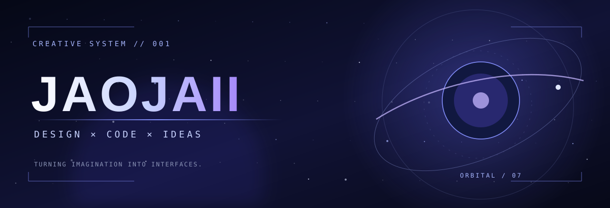

<div align="center">

<a href="https://github.com/J4oJx1i">
  
</a>

<br/>

<a href="https://github.com/J4oJx1i">
  
</a>

<br/>

<a href="https://amongstar.space"></a>
<a href="https://github.com/J4oJx1i"></a>
<a href="mailto:jaojaii.inwza@gmail.com"></a>

</div>

---

### `01 / IDENTITY` — Hello, I'm JAOJAII ✦

```typescript
const jaojaii = {
  identity: "Designer × Developer × Content Creator",
  mindset: ["curiosity", "creativity", "craft"],
  interests: ["UI/UX", "visual identity", "motion", "full-stack"],
  currentlyBuilding: "Among Star ✦",
  mission: "Turn strange ideas into beautiful, useful things.",
  status: "always creating",
};
```

I live where **design meets development**. I enjoy making interfaces that don't just work, but **feel alive** — with thoughtful motion, meaningful details, and a little bit of magic.

> **A good idea deserves to exist outside your imagination.**

---

### `02 / FEATURED TRANSMISSION` — Among Star 🌌

<div align="center">

<a href="https://amongstar.space"></a>

<br/><br/>

**A universe where feelings become signals, and strangers can feel less alone.**

*“ไม่ต้องรู้จักกัน ก็เข้าใจกันได้”*

<a href="https://amongstar.space"></a>

</div>

**Among Star** is a web experience built around anonymous emotional support and listening. Instead of chasing likes or popularity, people share temporary emotional **Signals** in a living **Galaxy**, offer encouragement, and connect through 1:1 Listening Spaces.

| ✦ The universe | ✧ The experience |
|:--|:--|
| 🌌 **Living Galaxy** | Feelings appear as temporary stars and signals |
| 💜 **Kindness first** | Encouragement without popularity rankings |
| 🎧 **Listening Spaces** | Temporary one-to-one conversations |
| 🛡️ **Safer community** | Age-aware systems, reporting and moderation |
| 🔭 **Observatory** | Purpose-built tools for community operations |

**Tech constellation**


**Explore:** [amongstar.space](https://amongstar.space)

---

### `03 / TOOLBOX` — My creative arsenal ⚡

**Development**


**Design & Creative**


I care about the details people might not notice consciously: **motion, hierarchy, spacing, atmosphere**, and the tiny interactions that make software feel human.

---

### `04 / SIGNAL STATUS` — Current transmission 🛰️

```yaml
CALLSIGN: JAOJAII
SECTOR: CREATIVE_UNIVERSE
SIGNAL: ONLINE

BUILDING:
  - Among Star
EXPLORING:
  - better product architecture
  - thoughtful animation and interaction
  - safer community systems
  - cleaner full-stack workflows
CREATIVE_FUEL:
  - UI / UX
  - visual identity
  - ambitious little experiments

MOTTO: "Stay curious. Make it real."
```

<div align="center">


<br/><br/>


<br/><br/>

**✦ Every strange idea is a possible new universe. ✦**

[Among Star](https://amongstar.space) · [GitHub](https://github.com/J4oJx1i) · [Say Hello](mailto:jaojaii.inwza@gmail.com)


</div>
