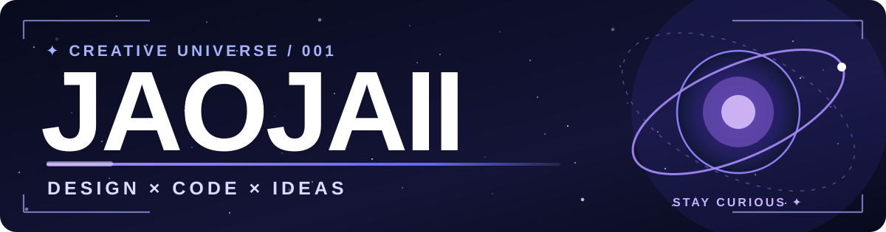

 

  
  
  

**DESIGN × DEVELOPMENT × IMAGINATION**

Crafting digital experiences with a little extra soul.

---

### ✦ 01 — ABOUT ME

Hey, I'm **JAOJAII** — a designer, developer and content creator.

I like turning unusual ideas into real things. I work across **UI/UX, visual identity, web development and creative experiments**, with an obsession for the little details that make an interface feel alive.

**What drives me**

- ✦ **Design with intention** — clean visuals, thoughtful motion and good hierarchy.
- ⚡ **Build what I imagine** — from the first sketch to working software.
- 🌌 **Create with feeling** — experiences that connect with real people.

> A good idea deserves to exist outside your imagination.

---

### 🌌 02 — FEATURED UNIVERSE

**AMONG STAR**

*ไม่ต้องรู้จักกัน ก็เข้าใจกันได้*

A space where feelings become stars and strangers can feel less alone.

**Among Star** is an anonymous emotional-support experience where people send their feelings as temporary **Signals** into a living **Galaxy**. There's room for encouragement, listening and meaningful connection — without popularity scores.

**Inside the universe**

- 🌠 **Living Galaxy** — temporary emotional signals visualized as stars.
- 💜 **Encouragement** — kindness without like counts.
- 🎧 **Listening Space** — temporary one-on-one listening conversations.
- 🛡️ **Safety** — age-aware systems, reporting and moderation.
- 🔭 **Observatory** — custom tools for community operations.

**Built with**

**Explore the project → [amongstar.space](https://amongstar.space)**

---

### ⚡ 03 — THE TOOLBOX

**Development**

**Design & creative**

**Favorite intersection:** where engineering meets feeling — motion, spacing, hierarchy, interaction and atmosphere.

---

### 🛰️ 04 — CURRENT TRANSMISSION

**CALLSIGN:** JAOJAII  
**STATUS:** Creating / learning / shipping  
**MAIN MISSION:** Among Star  
**SIDE QUESTS:** UI experiments, thoughtful animation, full-stack architecture

<b>✦ OPEN THE SIGNAL — What's on my radar?</b>

 

- Better product architecture and cleaner workflows
- Safer, more welcoming online communities
- Creative motion and interaction design
- Weird ideas worth prototyping

**Motto:** Stay curious. Make it real.

---

**✦ EVERY STRANGE IDEA COULD BE A NEW UNIVERSE ✦**

<a href="https://amongstar.space">Among Star</a> ·
<a href="https://github.com/J4oJx1i">GitHub</a> ·
<a href="mailto:jaojaii.inwza@gmail.com">Say hello</a>

  

  

